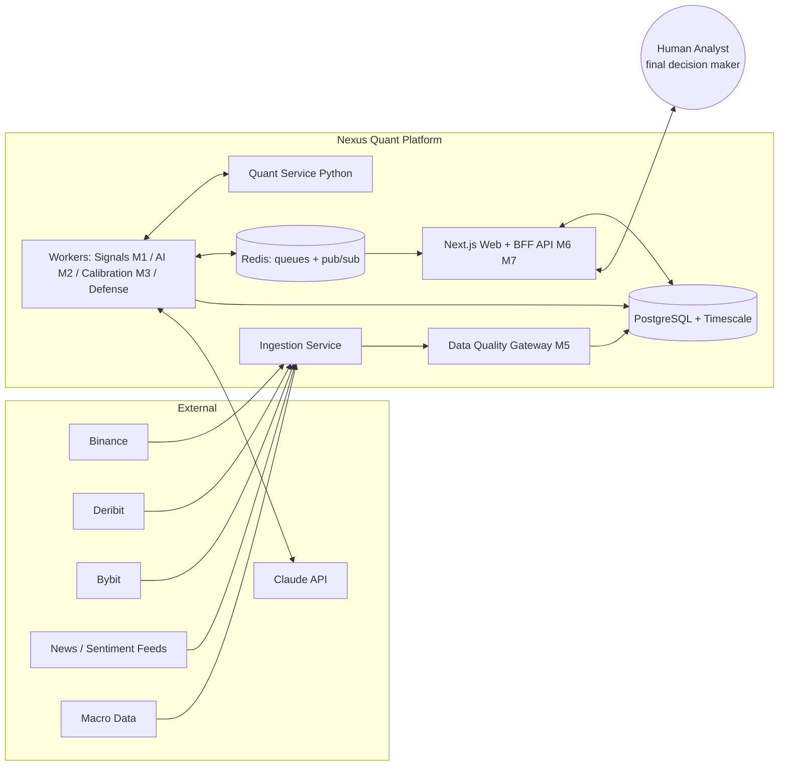
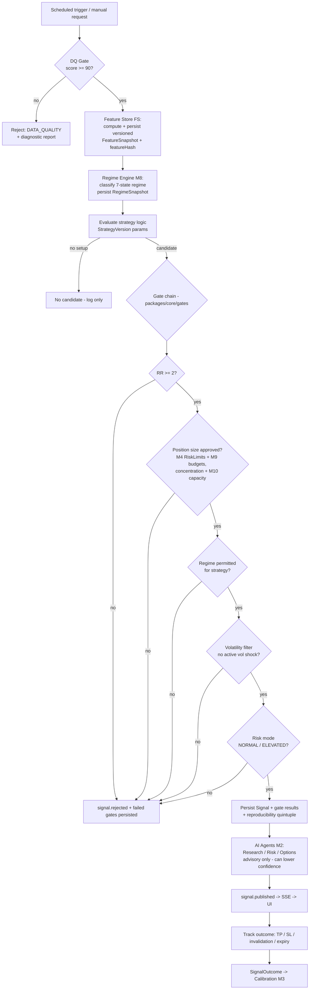
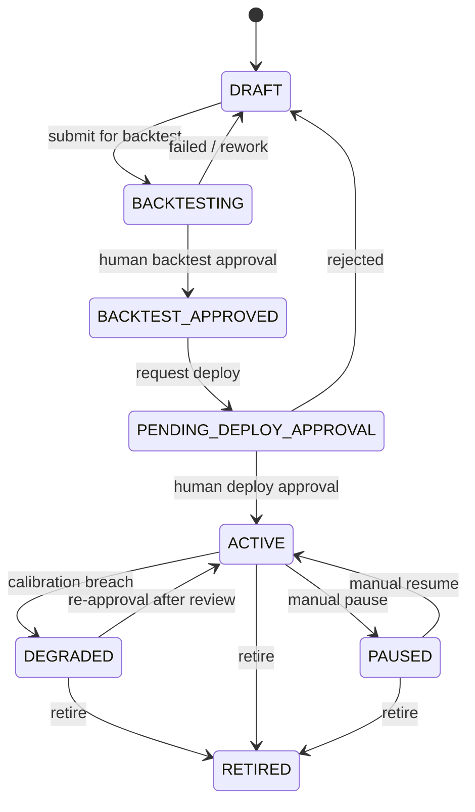
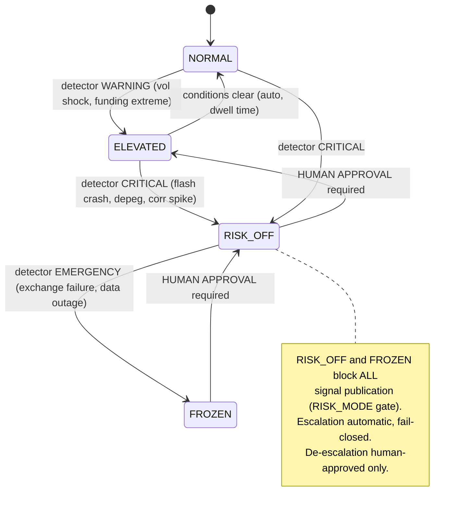
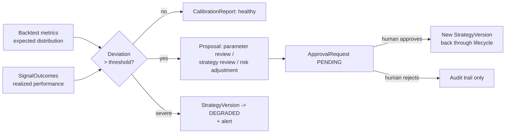
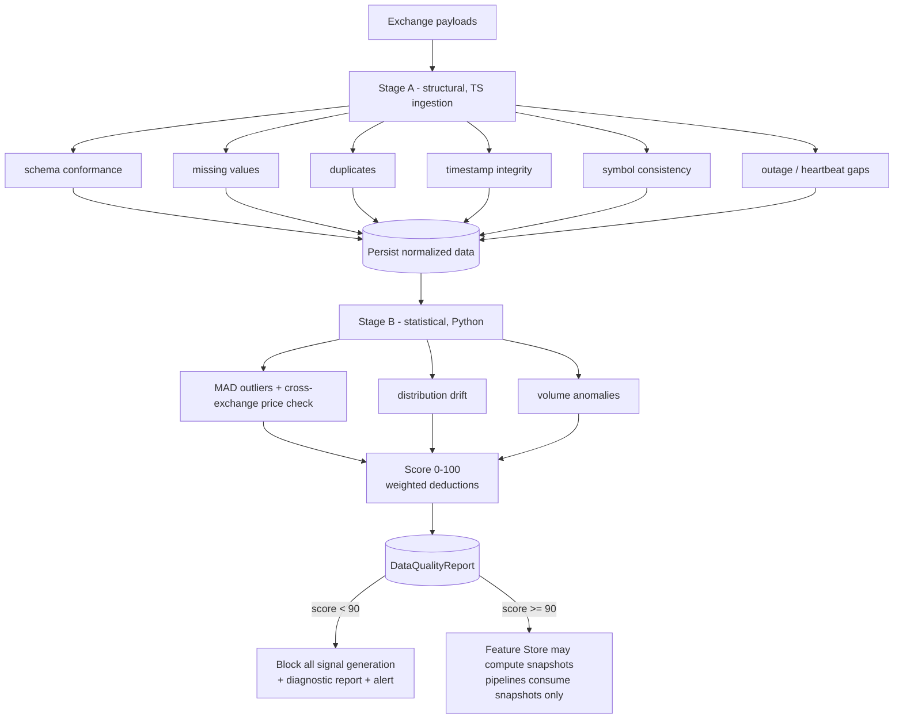
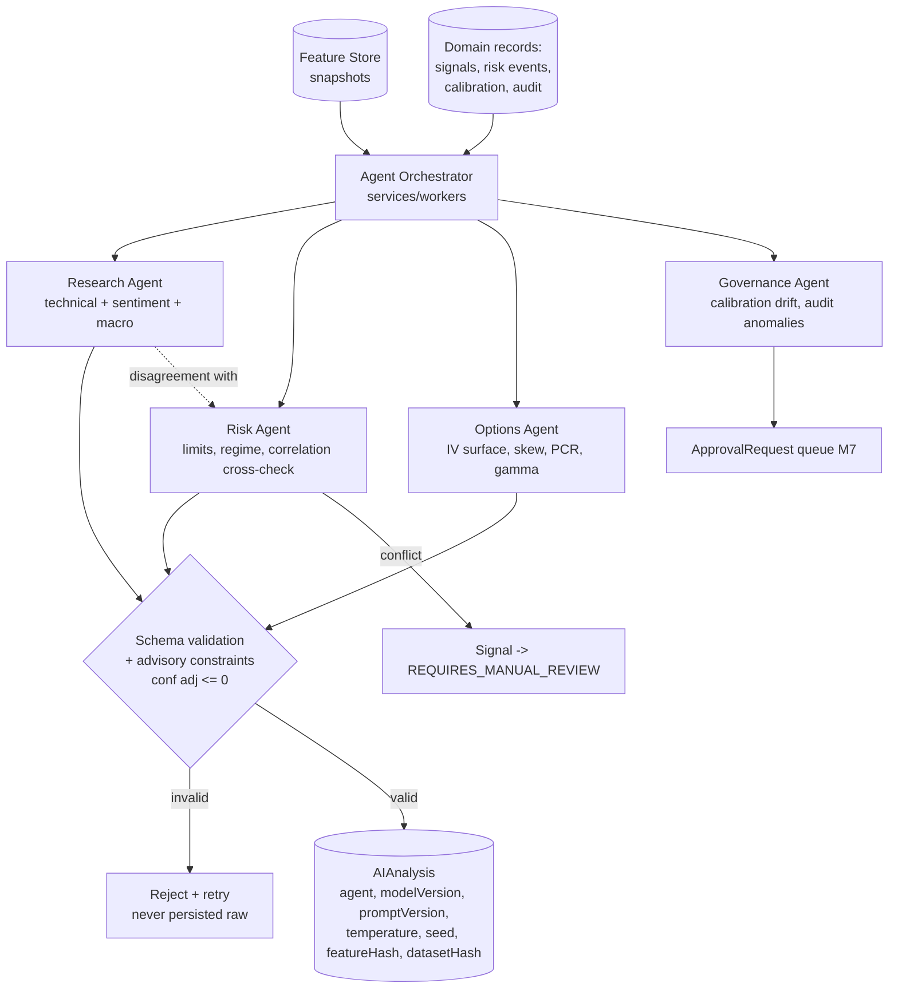
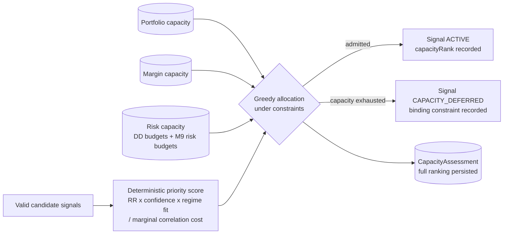

# Nexus Quant — System Diagrams

> Status: DRAFT — pending human approval. Diagrams in Mermaid.

## 1. System Context



## 2. Signal Generation Pipeline (M1) — data flow



## 3. Signal Generation — sequence

```mermaid
sequenceDiagram
    participant S as Scheduler (BullMQ)
    participant W as Signal Worker
    participant P as Quant Svc (Python)
    participant G as Gate Layer (core/gates)
    participant DB as Postgres
    participant AI as AI Orchestrator (Claude)
    participant UI as Web (SSE)

    S->>W: run(symbol, timeframe, strategyVersion)
    W->>DB: latest DataQualityReport(scope)
    alt score < 90
        W->>DB: persist rejection (DATA_QUALITY)
        W-->>UI: signal.rejected
    else score >= 90
        W->>P: /features/compute (FeatureSet vN)
        P->>DB: persist FeatureSnapshot + featureHash
        P-->>W: snapshot ref
        W->>P: /regime/classify (snapshot)
        P->>DB: persist RegimeSnapshot (7-state)
        P-->>W: regime + probabilities
        W->>W: evaluate strategy logic -> candidate?
        W->>P: /sizing/calculate + /capacity/assess
        P-->>W: size numbers + capacity ranking
        W->>G: run gate chain (RR, size+limits+budgets+capacity, regime, vol, mode)
        alt any gate fails
            W->>DB: persist candidate + failed GateResults
            W-->>UI: signal.rejected
        else all pass
            W->>DB: persist Signal + GateResults + lineage quintuple (ACTIVE)
            W->>AI: Research/Risk/Options agents (FeatureSnapshot inputs only)
            AI-->>W: theses / risks / invalidation (advisory)
            W->>DB: persist AIAnalysis (agent, modelVersion, promptVersion, temperature, seed; conf adj <= 0)
            W-->>UI: signal.published
        end
    end
```

## 4. Strategy Lifecycle (M7) — state machine



Every transition: mandatory `reason`, `AuditLog` row; approvals require
requester ≠ reviewer.

## 5. System Risk Mode — state machine



## 6. Calibration Loop (M3)



## 7. Data Quality Gateway (M5) — two stages



## 8. AI Agent Architecture (M2)



## 9. Capacity Planning & Signal Prioritization (M10)


