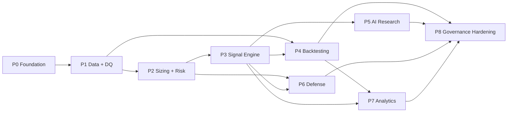

# Nexus Quant — Implementation Roadmap

> Status: DRAFT — pending human approval.
> Ordering follows the philosophy: data integrity and risk controls are built and
> verified **before** any signal can exist. Each phase ends with acceptance criteria;
> a phase is not "done" until they pass. Code is generated module-by-module, never
> monolithically.

## Phase 0 — Foundation & Scaffolding

**Scope:** monorepo (pnpm + Turborepo), `packages/{db,core,events,config}`, Prisma
schema + initial migration (incl. Timescale hypertable SQL), Docker Compose
(Postgres+Timescale, Redis, service skeletons), Next.js 15 app shell with dark theme
+ navigation for all 8 pages, FastAPI skeleton with `/health`, CI (lint, typecheck,
test), seed script (users, risk limits, detector configs).

**Acceptance:** `docker compose up` brings up all services healthy; `pnpm db:migrate
&& pnpm db:seed` succeeds; web shell renders; quant `/health` returns OK.

## Phase 1 — Data Layer: Ingestion + Data Quality Gateway (M5) + Feature Store (FS)

> Amended per approved architecture review (2026-06-12): options first-class,
> exchange priority Deribit > Binance > Bybit, flow data mandatory, feature
> domains, agent prompt seeds, regime transition matrix persistence, Demo Mode.

**Scope:** connectors in priority order **Deribit (primary), Binance (secondary),
Bybit (tertiary)** (REST backfill + WebSocket live) for candles, **funding rate,
open interest + OI delta, long/short ratio (mandatory Phase 1 ingest set)**,
**strike-level option chains (`OptionContractSnapshot`: expiry, strike, IV,
delta/gamma/theta/vega, OI, volume, bid/ask) + chain aggregates**, liquidity;
canonical normalization; Stage-A structural checks; Stage-B statistical checks in
Python; DQ scoring + `DataQualityReport`; gap detection/repair jobs; **Feature
Store organized into 5 domains (Technical, Options, Flow, Regime, Risk):
versioned `FeatureSetDefinition`s, point-in-time `FeatureSnapshot` computation
with canonical `featureHash`, DQ ≥ 90 admission rule**; `RegimeTransitionMatrix`
persistence (computation lands Phase 3); seeded v1 prompt templates for the four
M2 agents (distinct objectives); **Demo Mode: deterministic `DemoConnector`
(seeded PRNG) through the same DQ pipeline + demo seed (sample option chains,
signals, backtests) — repo runs end-to-end with no exchange credentials**; DQ +
features + market-data API endpoints + System Monitoring page (connector status,
DQ scores, demo banner).

**Acceptance:** 2 years of BTC/ETH H1 candles (live or demo) with DQ score ≥ 90;
synthetic corruption tests (injected gaps, duplicates, outliers) each produce
correct deductions and a FAILED report; live stream survives reconnect with no
duplicate rows (composite-unique upsert verified); identical inputs produce
identical `featureHash` across two runs; snapshot computation against DQ < 90
data is refused; **`DEMO_MODE=true` with the same `DEMO_SEED` produces an
identical dataset (hash-verified) on two machines with zero network access;
option chain queries return strike-level greeks via SQL, no JSON parsing**.

**Why first:** Priority 3 (data integrity) — nothing downstream is trustworthy
without it; the Feature Store makes validated data the *only* feature source.

## Phase 2 — Risk Substrate: Position Sizing (M4) + Risk Limits + Risk Mode

**Scope:** sizing methods (fixed fractional, fractional Kelly, ATR, vol targeting) in
Python with property-based tests; `RiskLimit` enforcement in `packages/core`;
`SystemRiskState` machine with approval-gated de-escalation; sizing + limits API;
Risk Engine page (limits, mode, sizing calculator).

**Acceptance:** sizing results match hand-computed fixtures to 8 dp; any limit breach
→ `approved=false`; RISK_OFF blocks downstream actions in integration test;
de-escalation without approval returns 202-with-ApprovalRequest, never acts.

**Why before signals:** the POSITION_SIZE and RISK_MODE gates must exist before the
first signal can be evaluated — risk is upstream by construction.

## Phase 3 — Quant Core + Market Regime Engine (M8) + Signal Execution Engine (M1)

**Scope:** indicator library (trend, momentum, volume, volatility, market structure)
via TA-Lib feeding Feature Store sets; **dedicated Market Regime Engine: 7-state
taxonomy (TRENDING_BULL, TRENDING_BEAR, RANGE_BOUND, HIGH_VOL, LOW_VOL, PANIC,
EUPHORIA) with persisted probabilities + evidence**; first reference strategy
version (fully governed: hypothesis, entry/exit, risk rules, failure conditions,
declared valid regimes); gate chain implementation; signal pipeline worker; signal
persistence + outcome tracking (TP/SL/invalidation/expiry watcher); Signal Center
page; SSE streaming.

**Acceptance:** end-to-end run on historical replay produces deterministic identical
signals across two runs (reproducibility quintuple equal); every published signal
has 6/6 gate results stored; forcing DQ=85 blocks generation; forcing RR=1.5
rejects with RISK_REWARD; regime classifier labels known historical windows
correctly (Mar-2020 → PANIC, Q4-2020 → TRENDING_BULL/EUPHORIA fixtures); a
strategy not declaring the current regime is rejected by MARKET_REGIME; outcome
watcher resolves a known TP-hit fixture correctly.

## Phase 4 — Backtesting & Calibration Engine (M3)

**Scope:** VectorBT engine + Backtrader cross-check; fees/slippage models;
walk-forward; Monte Carlo (trade resample + block bootstrap); stress scenarios
(Mar-2020, May-2021, FTX-2022 replays + synthetic); shared metrics module wired
into both backtests and live analytics; calibration worker + reports + proposals;
Backtesting Studio page.

**Acceptance:** VectorBT vs Backtrader metrics agree within tolerance on the
reference strategy; walk-forward reports OOS-only metrics; MC produces stable
drawdown percentiles across seeds (CI bounds); a synthetic expected-vs-actual
divergence produces a CalibrationReport with an ApprovalRequest and no auto-change.

## Phase 5 — AI Agent Architecture (M2)

**Scope:** Claude API integration with structured outputs; versioned prompt
templates; **four specialized agents — Research (technical/sentiment/macro), Risk
(limits/regime/correlation cross-check), Options (IV/skew/PCR/gamma), Governance
(calibration drift → approval proposals)** — consuming Feature Store snapshots
only; agent-disagreement → REQUIRES_MANUAL_REVIEW; advisory-only enforcement
(confidence adjustment ≤ 0, manual-review flagging); full reproducibility metadata
per analysis (modelVersion, promptVersion, temperature, seed, featureHash,
datasetHash); Research Lab page with per-agent views.

**Acceptance:** schema-invalid LLM output is rejected and retried, never persisted
raw; every analysis row carries the complete reproducibility set; a Research/Risk
agent conflict fixture flags the signal for manual review; Governance agent output
lands in the approval queue, never mutates state; an attempt to apply a positive
confidence adjustment fails at both app and DB layer.

## Phase 6 — Derivatives Defense Framework

**Scope:** BTC volatility shock detector (ATR explosion, regime shift, liquidity
collapse, funding extremes); ETH options risk detector (IV spike, IV crush, gamma,
PCR); black swan monitor (flash crash, exchange failure, depeg, correlation spike);
automatic actions (sizing scale-down, entry pause, confidence caps, mode
escalation); alerting; Risk Engine page extensions (event timeline, detector
configs).

**Acceptance:** replaying the May-2021 crash window through detectors raises
VOLATILITY_SHOCK and escalates to ELEVATED; a synthetic depeg fixture escalates to
RISK_OFF and the next pipeline run is blocked by the RISK_MODE gate; all actions
appear in `RiskEvent.actionsTaken` and the audit log.

## Phase 7 — Portfolio Construction (M9) + Capacity Planner (M10) + Analytics (M6)

**Scope:** **Portfolio Construction Engine: rolling + regime-conditional correlation
matrices, risk budgets per strategy/asset/regime, ERC allocation proposals,
concentration caps wired into the POSITION_SIZE gate**; **Strategy Capacity
Planner: portfolio/margin/risk capacity assessment cycle, deterministic signal
prioritization with CAPACITY_DEFERRED handling**; paper portfolio + snapshot jobs;
hypothetical trade simulation from signal outcomes; equity/drawdown curves,
monthly-returns heatmap, rolling Sharpe/vol, trade distribution, attribution,
benchmark comparison, strategy health score; CSV/JSON/PDF export pipeline;
Dashboard + Portfolio Analytics pages (incl. correlation heatmap, risk budget
utilization, capacity gauges).

**Acceptance:** analytics metrics for a replayed period equal the backtest metrics
for the same period/strategy (shared metrics module proven); exports reproduce
on-screen numbers exactly; a risk-budget-exhausted fixture fails POSITION_SIZE
with RISK_BUDGET_EXCEEDED; two concurrent valid signals exceeding capacity result
in exactly one ACTIVE and one CAPACITY_DEFERRED with the binding constraint and
full ranking persisted; the prioritization score is reproducible across runs.

## Phase 8 — Governance Hardening + Production Readiness (M7+)

**Scope:** full approval workflows UI (backtest approval, deploy approval, parameter
changes, AI recommendations, risk-mode de-escalation); audit-trail browsing with
diffs; strategy version diff view; RBAC enforcement; observability (structured
logs, JobRun dashboards, queue depth alerts); runbooks (exchange outage, RISK_OFF
recovery, DB restore); backup strategy; load/failure testing (kill Redis/Postgres
mid-pipeline → fail-closed, no partial signals).

**Acceptance:** self-approval rejected; every mutation in a full E2E pass has an
audit row with before/after diff; chaos test (kill quant svc mid-run) leaves no
ACTIVE signal without complete gate results; runbook walkthrough executed.

## Cross-Cutting (every phase)

- Tests: unit + property-based (sizing/metrics), integration per pipeline, E2E
  (Playwright) per page; fixtures from real historical data.
- Every numeric module ships with hand-verified fixture tests before integration.
- No phase introduces a path that bypasses the gate chain — enforced by code review
  checklist + an integration test that attempts bypass.

## Dependency Graph

